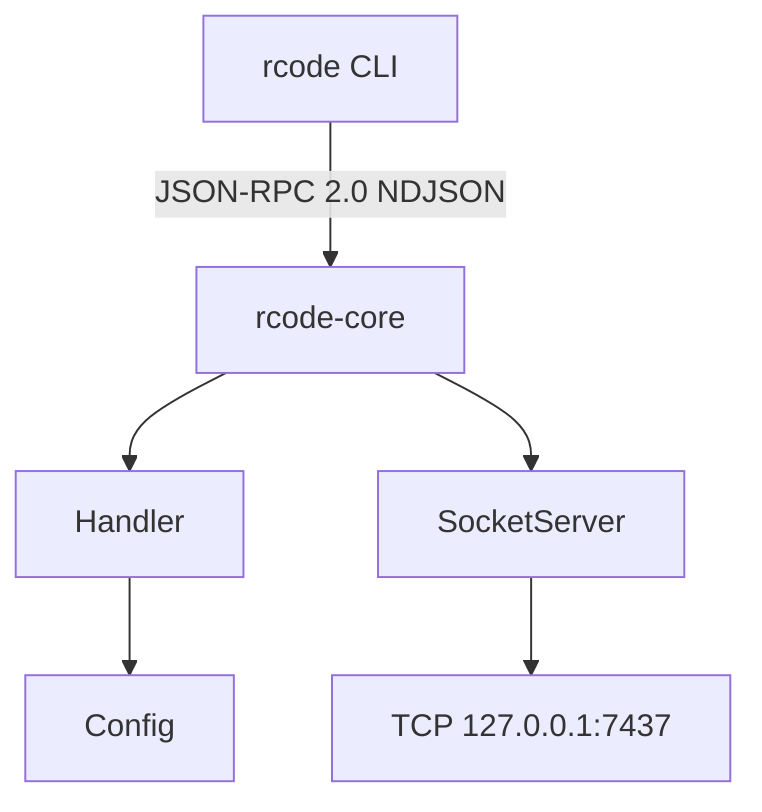

# v0.1 骨架与协议 — 设计文档

> Spec: `20260712-v01-skeleton-protocol`
> 阶段：设计规划
> 日期：2026-07-12
> 状态：已完成

## 1. 整体架构



## 2. 模块划分与职责

| 模块 | 职责 |
|------|------|
| `core/bus/envelope.py` | JSON-RPC 消息模型（Request、Success、Error） |
| `core/bus/commands.py` | 命令定义（PingCommand、PongResult） |
| `core/transport/socket_server.py` | TCP 服务端，接收命令并分发 |
| `core/transport/socket_client.py` | TCP 客户端，发送命令 |
| `core/config.py` | 四级配置管理 |
| `core/app.py` | Core 守护进程入口 |
| `cli/main.py` | CLI 主入口（argparse） |
| `cli/commands/ping.py` | ping 命令实现 |

## 3. 接口定义

### 3.1 JSON-RPC 请求

```json
{
  "jsonrpc": "2.0",
  "id": "cli-1",
  "method": "core.ping",
  "params": {"client": "cli/0.1.0"}
}
```

### 3.2 JSON-RPC 响应

```json
{
  "jsonrpc": "2.0",
  "id": "cli-1",
  "result": {
    "server_version": "0.1.0",
    "uptime_ms": 1003,
    "received_at": "2026-07-12T06:50:37.229069+00:00"
  }
}
```

## 4. 数据模型

### 4.1 JsonRpcRequest

```python
class JsonRpcRequest(BaseModel):
    jsonrpc: str = "2.0"
    id: str
    method: str
    params: dict[str, Any] = Field(default_factory=dict)
```

### 4.2 PongResult

```python
class PongResult(BaseModel):
    server_version: str
    uptime_ms: int
    received_at: str
```

## 5. 错误处理策略

| 错误码 | 常量 | 说明 |
|--------|------|------|
| -32700 | PARSE_ERROR | JSON 解析错误 |
| -32600 | INVALID_REQUEST | 请求格式错误 |
| -32601 | METHOD_NOT_FOUND | 方法不存在 |
| -32602 | INVALID_PARAMS | 参数错误 |
| -32603 | INTERNAL_ERROR | 服务器内部错误 |

## 6. 配置管理

四级优先级：默认值 → 全局 TOML → 项目 TOML → .env → 环境变量

```toml
[core]
host = "127.0.0.1"
port = 7437

[logging]
level = "INFO"
file = "~/.rcode/logs/core.log"
```
