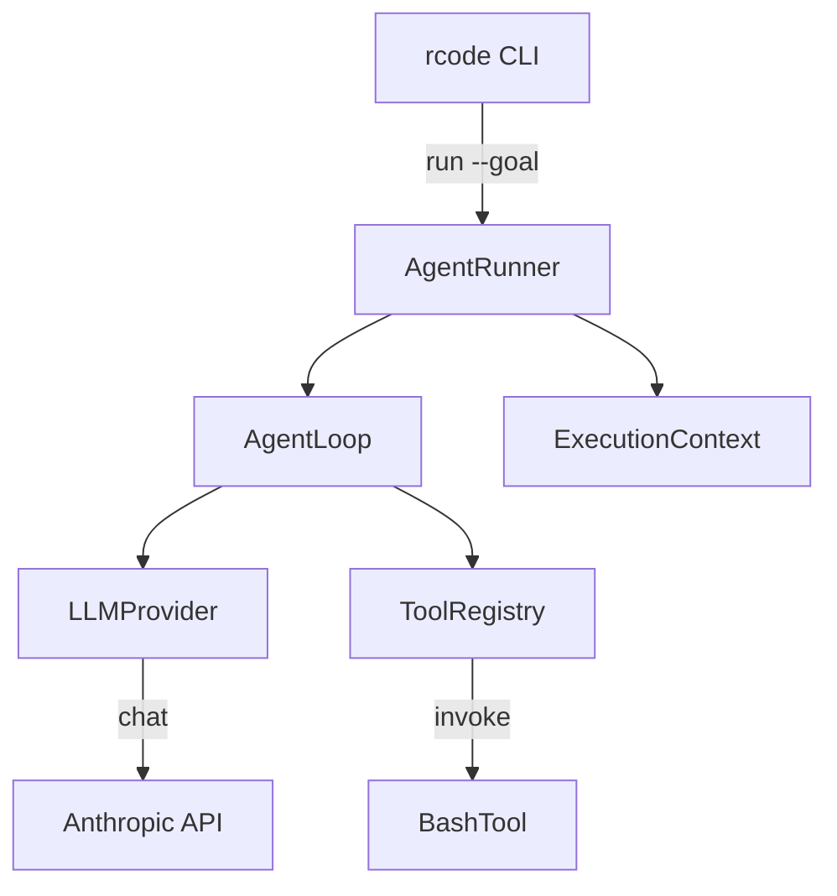

# v0.2 Agent 最小闭环 — 设计文档

> Spec: `20260712-v02-agent-loop`
> 阶段：设计规划
> 日期：2026-07-12
> 状态：待确认

## 1. 设计目标

实现一个最小可运行的 Agent Loop，同时保持扩展性。

**核心原则**：
- 最小闭环：goal → LLM → 工具调用 → 结果回填 → 任务完成
- 扩展性：接口预留，便于后续版本扩展
- 不过度设计：只实现这一阶段必须的功能

## 2. 整体架构



## 3. 模块设计

### 3.1 Agent Loop (`core/loop.py`)

```python
class AgentLoop:
    def __init__(self, provider: LLMProvider, registry: ToolRegistry):
        self._provider = provider
        self._registry = registry

    async def run(self, context: ExecutionContext) -> None:
        while not context.is_done():
            context.step += 1

            # Plan: 调用 LLM
            response = await self._provider.chat(
                messages=context.messages,
                tool_schemas=self._registry.tool_schemas(),
                system=context.system_prompt(),
            )

            # Observe: 添加助手消息
            context.add_assistant_message(response)

            # Act: 执行工具调用
            if response.stop_reason == "tool_use":
                for tool_call in response.tool_calls:
                    result = await invoke_tool(self._registry, tool_call)
                    context.add_tool_result(tool_call.id, result)
            elif response.stop_reason == "end_turn":
                context.mark_done()
            elif context.step >= context.max_steps:
                context.mark_failed("exceeded_max_steps")
                break
```

**设计要点**：
- 循环控制：`while not context.is_done()`
- 三阶段：plan → observe → act
- 终止条件：end_turn / max_steps / 错误
- 扩展点：后续可添加压缩触发、事件发布

### 3.2 LLM Provider (`core/llm/`)

**base.py** - 抽象基类：
```python
class LLMProvider(ABC):
    @abstractmethod
    async def chat(
        self,
        messages: list[dict],
        tool_schemas: list[dict],
        system: str,
    ) -> ChatResponse: ...
```

**provider.py** - Anthropic 实现：
```python
class AnthropicProvider(LLMProvider):
    def __init__(self, model: str):
        self._client = anthropic.AsyncAnthropic()
        self._model = model

    async def chat(self, messages, tool_schemas, system) -> ChatResponse:
        response = await self._client.messages.create(
            model=self._model,
            max_tokens=8096,
            system=system,
            messages=messages,
            tools=tool_schemas,
        )
        return self._parse_response(response)
```

**types.py** - 类型定义：
```python
@dataclass
class ChatResponse:
    text: str | None
    tool_calls: list[ToolCall]
    stop_reason: str  # "tool_use" | "end_turn" | "max_tokens"

@dataclass
class ToolCall:
    id: str
    name: str
    input: dict
```

**设计要点**：
- 使用 ABC 便于后续扩展其他 LLM 提供商
- v0.2 只实现 Anthropic，后续可添加 OpenAI、DeepSeek 等
- 流式输出、重试机制留给后续版本

### 3.3 Tool System (`core/tools/`)

**base.py** - 工具基类：
```python
class BaseTool(ABC):
    name: str
    description: str
    input_schema: dict

    @abstractmethod
    async def invoke(self, params: dict) -> ToolResult: ...

@dataclass
class ToolResult:
    content: str
    is_error: bool = False
    error_type: str | None = None
```

**registry.py** - 工具注册表：
```python
class ToolRegistry:
    def __init__(self):
        self._tools: dict[str, BaseTool] = {}

    def register(self, tool: BaseTool):
        self._tools[tool.name] = tool

    def get(self, name: str) -> BaseTool | None:
        return self._tools.get(name)

    def tool_schemas(self) -> list[dict]:
        return [
            {"name": t.name, "description": t.description, "input_schema": t.input_schema}
            for t in self._tools.values()
        ]
```

**invocation.py** - 工具调用：
```python
async def invoke_tool(registry: ToolRegistry, tool_call: ToolCall) -> ToolResult:
    tool = registry.get(tool_call.name)
    if not tool:
        return ToolResult(content=f"Tool not found: {tool_call.name}", is_error=True)

    try:
        return await asyncio.wait_for(
            tool.invoke(tool_call.input),
            timeout=30.0,
        )
    except asyncio.TimeoutError:
        return ToolResult(content="Tool execution timed out", is_error=True, error_type="timeout")
    except Exception as e:
        return ToolResult(content=str(e), is_error=True, error_type="runtime_error")
```

**builtin/bash.py** - Bash 工具：
```python
class BashTool(BaseTool):
    name = "bash"
    description = "Execute a bash command"
    input_schema = {
        "type": "object",
        "properties": {
            "command": {"type": "string", "description": "Command to execute"}
        },
        "required": ["command"]
    }

    async def invoke(self, params: dict) -> ToolResult:
        try:
            result = subprocess.run(
                params["command"],
                shell=True,
                capture_output=True,
                text=True,
                timeout=30,
            )
            output = result.stdout + result.stderr
            if len(output) > 50000:
                output = output[:50000] + "\n... (output truncated)"
            return ToolResult(content=output)
        except subprocess.TimeoutExpired:
            return ToolResult(content="Command timed out", is_error=True, error_type="timeout")
```

**设计要点**：
- 注册表模式：便于添加新工具
- 超时保护：30 秒超时
- 输出截断：防止过长输出
- 扩展点：后续可添加权限检查、重试机制

### 3.4 ExecutionContext (`core/context.py`)

```python
@dataclass
class ExecutionContext:
    goal: str
    run_id: str
    max_steps: int = 20
    messages: list[dict] = field(default_factory=list)
    step: int = 0
    status: str = "running"  # "running" | "success" | "failed"
    result: str | None = None
    _is_done: bool = False

    def __post_init__(self):
        if not self.messages:
            self.messages = [{"role": "user", "content": self.goal}]

    def system_prompt(self) -> str:
        return (
            "You are a helpful AI assistant. "
            "Use the available tools to complete the user's goal. "
            "When the goal is fully achieved, respond with a final answer "
            "and do not call any more tools."
        )

    def add_assistant_message(self, response: ChatResponse):
        blocks = []
        if response.text:
            blocks.append({"type": "text", "text": response.text})
        for tc in response.tool_calls:
            blocks.append({"type": "tool_use", "id": tc.id, "name": tc.name, "input": tc.input})
        self.messages.append({"role": "assistant", "content": blocks})

    def add_tool_result(self, tool_use_id: str, result: ToolResult):
        self.messages.append({
            "role": "user",
            "content": [{"type": "tool_result", "tool_use_id": tool_use_id, "content": result.content}]
        })

    def is_done(self) -> bool:
        return self._is_done or self.status != "running"

    def mark_done(self):
        self._is_done = True
        self.status = "success"

    def mark_failed(self, reason: str):
        self._is_done = True
        self.status = "failed"
        self.result = reason
```

**设计要点**：
- 消息历史管理
- 状态机：running / success / failed
- 扩展点：后续可添加消息合并、context 注入

### 3.5 AgentRunner (`core/runner.py`)

```python
class AgentRunner:
    def __init__(self, config: RcodeConfig):
        self._config = config
        self._provider = AnthropicProvider(config.llm.model)
        self._registry = ToolRegistry()
        self._register_builtin_tools()

    def _register_builtin_tools(self):
        self._registry.register(BashTool())

    async def run(self, goal: str) -> RunOutcome:
        run_id = f"run_{int(time.time())}_{uuid4().hex[:8]}"
        context = ExecutionContext(goal=goal, run_id=run_id)
        loop = AgentLoop(self._provider, self._registry)

        try:
            await loop.run(context)
            return RunOutcome(
                status=context.status,
                result=context.result or context.messages[-1].get("content", ""),
            )
        except Exception as e:
            return RunOutcome(status="failed", result=str(e))

@dataclass
class RunOutcome:
    status: str
    result: str
```

**设计要点**：
- 组装所有依赖
- 统一的运行入口
- 错误处理
- 扩展点：后续可添加 EventBus、Compactor

## 4. 目录结构

```
src/rcode/core/
├── __init__.py
├── loop.py              # Agent Loop
├── runner.py            # AgentRunner
├── context.py           # ExecutionContext
├── llm/
│   ├── __init__.py
│   ├── base.py          # LLMProvider ABC
│   ├── provider.py      # AnthropicProvider
│   └── types.py         # ChatResponse, ToolCall
└── tools/
    ├── __init__.py
    ├── base.py           # BaseTool, ToolResult
    ├── registry.py       # ToolRegistry
    ├── invocation.py     # invoke_tool
    └── builtin/
        ├── __init__.py
        └── bash.py       # BashTool
```

## 5. 错误处理

| 错误类型 | 处理方式 |
|----------|----------|
| LLM 调用失败 | 返回错误，终止循环 |
| 工具不存在 | 返回错误信息，循环继续 |
| 工具执行超时 | 返回超时错误，循环继续 |
| 工具执行异常 | 返回错误信息，循环继续 |
| 步数超限 | 强制终止循环 |

## 6. 扩展性设计

| 扩展点 | 预留位置 | 后续版本 |
|--------|----------|----------|
| LLM 提供商 | LLMProvider ABC | v0.16 多模型 |
| 工具注册 | ToolRegistry.register() | v0.3 工具扩展 |
| 事件发布 | EventBus 接口预留 | v0.4 事件流 |
| 权限检查 | invoke_tool() 预留 | v0.9 权限系统 |
| 上下文压缩 | AgentLoop 预留 | v0.7 压缩 |
| Session 回放 | ExecutionContext 预留 | v0.6 会话管理 |