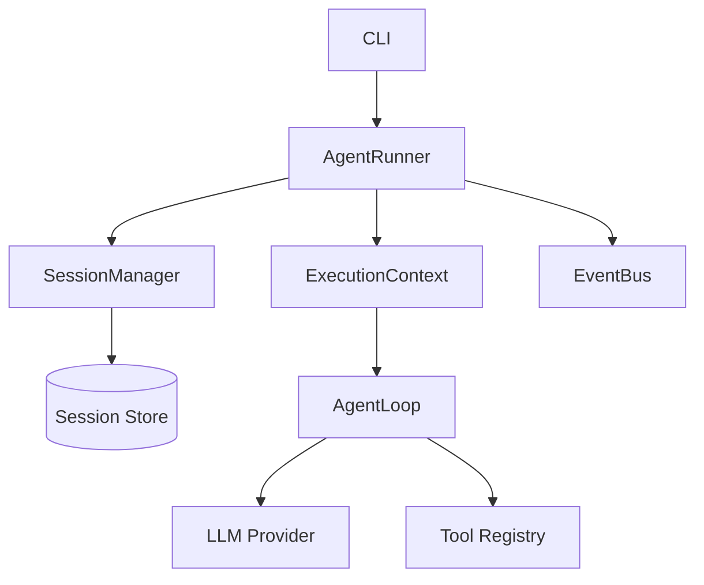

# Session ↔ Runner 接线重构 — 设计文档

> Spec: `20260715-v0.7.1-session-runner`
> 阶段：设计规划
> 日期：2026-07-15
> 状态：待确认

## 1. 架构设计

### 1.1 整体架构



### 1.2 架构说明

- **AgentRunner**：改造入口签名，支持两种模式
- **SessionManager**：加载/创建/保存 session
- **ExecutionContext**：从 session 构建，灌入历史 messages
- **EventBus**：发布 session 生命周期事件

---

## 2. 模块设计

### 2.1 模块清单

| 模块 | 职责 | 依赖 |
|------|------|------|
| AgentRunner | 执行 Agent 任务，管理 session 生命周期 | SessionManager, AgentLoop |
| SessionManager | 加载/创建/保存 session | SessionStore |
| ExecutionContext | 执行上下文，管理消息历史 | Session |

### 2.2 模块详细设计

#### AgentRunner.run()

**职责**：改造入口签名，支持两种模式

**接口**：

```python
async def run(
    self,
    goal_or_session: str,
    user_input: str | None = None,
) -> RunOutcome:
    """
    执行 Agent 任务。
    
    旧模式：run(goal) - 创建一次性 session
    新模式：run(session_id, user_input) - 使用指定 session
    """
```

#### SessionManager.load_context()

**职责**：从已有 session 构建 ExecutionContext

**接口**：

```python
async def load_context(self, session_id: str) -> ExecutionContext | None:
    """从已有 session 构建 ExecutionContext，灌入历史 messages。"""
```

---

## 3. 数据模型

### 3.1 Session 扩展

```python
class Session:
    id: str
    mode: SessionMode  # "one_shot" | "chat"
    status: SessionStatus  # "active" | "waiting_for_input" | "closed"
    title: str
    created_at: str
    updated_at: str
    run_ids: list[str]
    last_goal: str  # 新增：最后的 goal
```

---

## 4. 接口设计

### 4.1 run 命令变更

| 模式 | 调用方式 | 行为 |
|------|----------|------|
| 旧模式 | `run(goal)` | 创建一次性 session，run 结束后丢弃 |
| 新模式 | `run(session_id, user_input)` | 加载/创建 session，run 结束后保存 |

---

## 5. 错误处理

### 5.1 错误场景

| 场景 | 处理方式 |
|------|----------|
| session 不存在 | 创建新 session |
| session 加载失败 | 报错，不静默新建 |
| session 保存失败 | 报错，日志记录 |

---

## 6. 技术选型

无新增技术选型，沿用现有模块。
