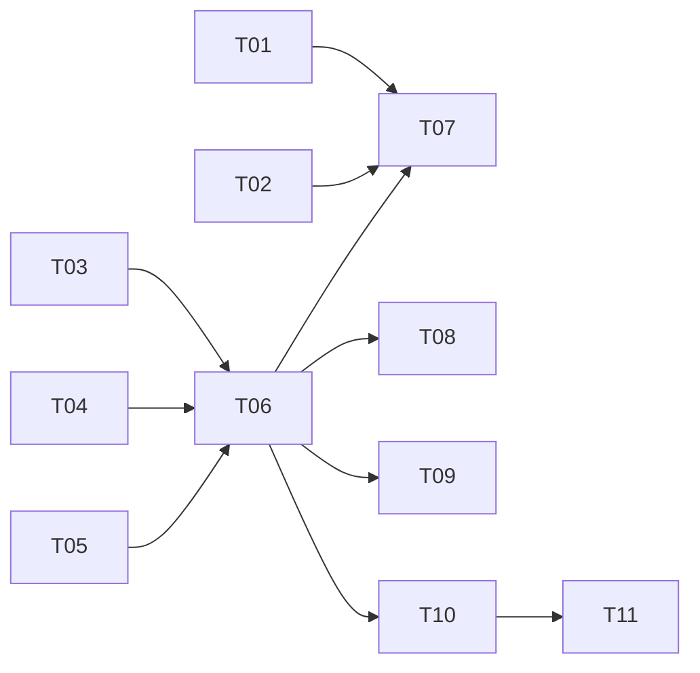

# Session ↔ Runner 接线重构 — 实现计划

> Spec: `20260715-v0.7.1-session-runner`
> 阶段：设计规划
> 日期：2026-07-15
> 状态：已完成

## 任务清单

### 阶段一：事件类型扩展

| 序号 | 任务 | 优先级 | 预估时间 | 状态 |
|------|------|--------|----------|------|
| T01 | 新增 SessionAttachedEvent 事件类型 | P0 | 10min | [x] |
| T02 | 新增 SessionDetachedEvent 事件类型 | P0 | 10min | [x] |

### 阶段二：SessionManager 扩展

| 序号 | 任务 | 优先级 | 预估时间 | 状态 |
|------|------|--------|----------|------|
| T03 | SessionManager 添加 load_context() 方法 | P0 | 20min | [x] |
| T04 | SessionManager 添加 save() 方法 | P0 | 15min | [x] |

### 阶段三：Runner 改造

| 序号 | 任务 | 优先级 | 预估时间 | 状态 |
|------|------|--------|----------|------|
| T05 | AgentRunner.run() 签名变更，支持两种模式 | P0 | 30min | [x] |
| T06 | AgentRunner 集成 SessionManager | P0 | 20min | [x] |
| T07 | AgentRunner 发布 session.attached/detached 事件 | P1 | 10min | [x] |

### 阶段四：CLI 适配

| 序号 | 任务 | 优先级 | 预估时间 | 状态 |
|------|------|--------|----------|------|
| T08 | CLI run 命令添加 --session 参数 | P1 | 15min | [x] |

### 阶段五：测试

| 序号 | 任务 | 优先级 | 预估时间 | 状态 |
|------|------|--------|----------|------|
| T09 | 单元测试：SessionManager.load_context() | P0 | 20min | [x] |
| T10 | 单元测试：AgentRunner.run() 两种模式 | P0 | 20min | [x] |
| T11 | 集成测试：多轮对话场景 | P0 | 30min | [-] |
| T12 | 单元测试：SessionManager.load() | P0 | 10min | [x] |
| T13 | 单元测试：SessionManager.save() | P0 | 10min | [x] |
| T14 | 单元测试：SessionManager.load_context() 不存在 | P0 | 10min | [x] |

## 依赖关系

## 状态说明

- `[ ]` 未开始
- `[x]` 已完成
- `[-]` 已跳过
- `[!]` 阻塞
