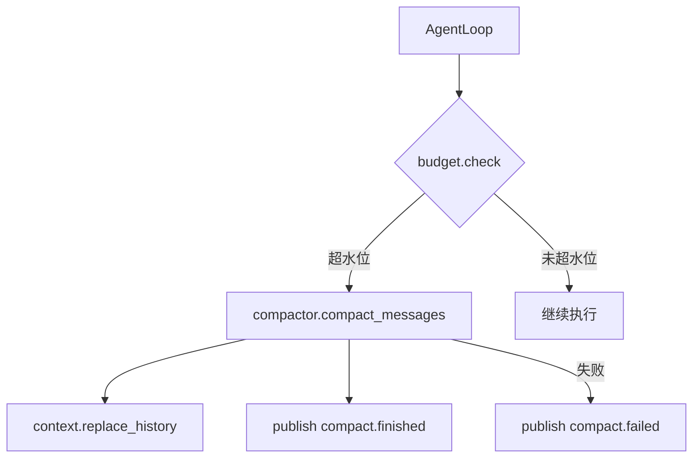

# Compactor ↔ Loop 接线重构 — 设计文档

> Spec: `20260716-v072-compactor-loop`
> 阶段：设计规划
> 日期：2026-07-16
> 状态：待确认

## 1. 架构设计

### 1.1 整体架构



### 1.2 架构说明

- **TokenBudget**：检查消息水位
- **Compactor**：LLM 驱动的上下文压缩
- **AgentLoop**：每步开始前检查水位

---

## 2. 模块设计

### 2.1 模块清单

| 模块 | 职责 | 依赖 |
|------|------|------|
| TokenBudget | 水位检查 | 无 |
| Compactor | 上下文压缩 | LLM Provider |
| ExecutionContext | 替换历史 | 无 |
| AgentLoop | 集成压缩 | TokenBudget, Compactor |

### 2.2 模块详细设计

#### TokenBudget.check()

**职责**：检查是否需要压缩

**接口**：

```python
async def check(self, messages: list[dict], max_tokens: int = 100000) -> bool:
    """检查是否需要压缩。"""
```

#### ExecutionContext.replace_history()

**职责**：用摘要替换历史消息

**接口**：

```python
def replace_history(self, summary: str) -> None:
    """用摘要替换 runtime 中的旧 messages。"""
```

---

## 3. 数据模型

### 3.1 新增事件

```python
class CompactTriggeredEvent(BaseModel):
    session_id: str
    run_id: str
    message_count: int

class CompactFinishedEvent(BaseModel):
    before_tokens: int
    after_tokens: int
    ratio: float

class CompactFailedEvent(BaseModel):
    error: str
```

---

## 4. 接口设计

### 4.1 AgentLoop 变更

```python
class AgentLoop:
    def __init__(self, ..., compactor=None, compact_threshold=0.0):
        self._compactor = compactor
        self._compact_threshold = compact_threshold
        self._budget = TokenBudget(compact_threshold)
```

---

## 5. 错误处理

### 5.1 错误场景

| 场景 | 处理方式 |
|------|----------|
| 压缩失败 | 保持原 messages，发 compact.failed 事件 |
| LLM 调用失败 | 同上 |

---

## 6. 技术选型

无新增技术选型，沿用现有模块。
