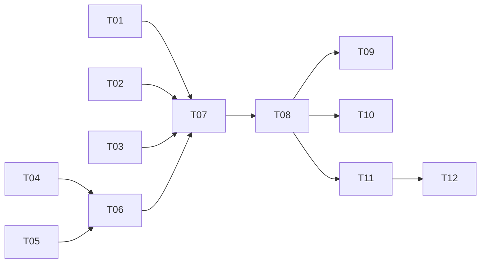

# Compactor ↔ Loop 接线重构 — 实现计划

> Spec: `20260716-v072-compactor-loop`
> 阶段：设计规划
> 日期：2026-07-16
> 状态：已完成

## 任务清单

### 阶段一：事件类型扩展

| 序号 | 任务 | 优先级 | 预估时间 | 状态 |
|------|------|--------|----------|------|
| T01 | 新增 CompactTriggeredEvent 事件类型 | P0 | 10min | [x] |
| T02 | 新增 CompactFinishedEvent 事件类型 | P0 | 10min | [x] |
| T03 | 新增 CompactFailedEvent 事件类型 | P0 | 10min | [x] |

### 阶段二：TokenBudget 扩展

| 序号 | 任务 | 优先级 | 预估时间 | 状态 |
|------|------|--------|----------|------|
| T04 | TokenBudget 添加 check() 方法 | P0 | 15min | [x] |

### 阶段三：ExecutionContext 扩展

| 序号 | 任务 | 优先级 | 预估时间 | 状态 |
|------|------|--------|----------|------|
| T05 | ExecutionContext 添加 replace_history() 方法 | P0 | 10min | [x] |

### 阶段四：AgentLoop 改造

| 序号 | 任务 | 优先级 | 预估时间 | 状态 |
|------|------|--------|----------|------|
| T06 | AgentLoop 接入 TokenBudget 和 Compactor | P0 | 30min | [x] |
| T07 | AgentLoop 添加 _do_compact() 方法 | P0 | 20min | [x] |

### 阶段五：Runner 改造

| 序号 | 任务 | 优先级 | 预估时间 | 状态 |
|------|------|--------|----------|------|
| T08 | Runner 传入 Compactor 和 compact_threshold | P0 | 15min | [x] |

### 阶段六：测试

| 序号 | 任务 | 优先级 | 预估时间 | 状态 |
|------|------|--------|----------|------|
| T09 | 单元测试：TokenBudget.check() | P0 | 15min | [x] |
| T10 | 单元测试：ExecutionContext.replace_history() | P0 | 10min | [x] |
| T11 | 单元测试：AgentLoop 压缩流程 | P0 | 20min | [x] |
| T12 | 集成测试：超预算触发压缩 | P0 | 20min | [-] |

## 依赖关系

## 状态说明

- `[ ]` 未开始
- `[x]` 已完成
- `[-]` 已跳过
- `[!]` 阻塞
