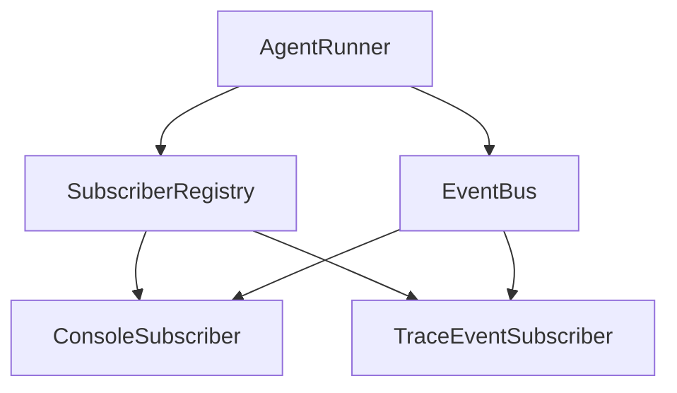

# 事件订阅装配解耦 — 设计文档

> Spec: `20260716-v073-event-subscriber-decouple`
> 阶段：设计规划
> 日期：2026-07-16
> 状态：待确认

## 1. 架构设计

### 1.1 整体架构



### 1.2 架构说明

- **SubscriberRegistry**：订阅者注册中心，支持错误隔离
- **ConsoleSubscriber**：终端事件打印，从 runner.py 挪出
- **TraceEventSubscriber**：Trace 事件写入，已有

---

## 2. 模块设计

### 2.1 模块清单

| 模块 | 职责 | 依赖 |
|------|------|------|
| SubscriberRegistry | 订阅者注册和构建 | 无 |
| ConsoleSubscriber | 终端事件打印 | 无 |
| AgentRunner | 使用 registry 订阅事件 | SubscriberRegistry |

### 2.2 模块详细设计

#### SubscriberRegistry

**职责**：订阅者注册和构建，支持错误隔离

**接口**：

```python
class SubscriberRegistry:
    def register(self, subscriber: Callable) -> None
    def build(self) -> list[Callable]
```

#### ConsoleSubscriber

**职责**：终端事件打印

**接口**：

```python
class ConsoleSubscriber:
    def __call__(self, event: BaseModel) -> None
```

---

## 3. 数据模型

### 3.1 新增事件

```python
class BusSubscriberErrorEvent(BaseModel):
    subscriber: str
    error: str
```

---

## 4. 接口设计

### 4.1 Runner 变更

```python
class AgentRunner:
    def __init__(self, config):
        self._subscriber_registry = build_default_subscribers(config)

    async def run(self, ...):
        for subscriber in self._subscriber_registry.build():
            self._bus.subscribe(subscriber)
```

---

## 5. 错误处理

### 5.1 错误场景

| 场景 | 处理方式 |
|------|----------|
| 订阅者异常 | 捕获异常，不影响其他订阅者 |
| 配置缺失 | 使用默认值 |

---

## 6. 技术选型

无新增技术选型，沿用现有模块。
