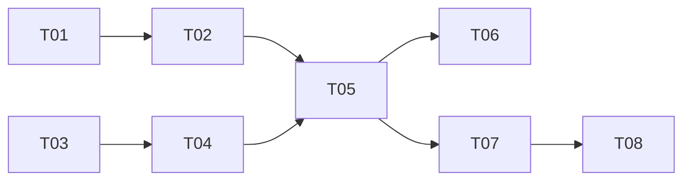

# 事件订阅装配解耦 — 实现计划

> Spec: `20260716-v073-event-subscriber-decouple`
> 阶段：设计规划
> 日期：2026-07-16
> 状态：已完成

## 任务清单

### 阶段一：SubscriberRegistry 实现

| 序号 | 任务 | 优先级 | 预估时间 | 状态 |
|------|------|--------|----------|------|
| T01 | 新增 SubscriberRegistry 类 | P0 | 20min | [x] |
| T02 | 新增 build_default_subscribers 工厂函数 | P0 | 15min | [x] |

### 阶段二：ConsoleSubscriber 挪出

| 序号 | 任务 | 优先级 | 预估时间 | 状态 |
|------|------|--------|----------|------|
| T03 | 新增 cli/printer.py | P0 | 20min | [x] |
| T04 | 从 runner.py 移除 _EventPrinter | P0 | 10min | [x] |

### 阶段三：Runner 改造

| 序号 | 任务 | 优先级 | 预估时间 | 状态 |
|------|------|--------|----------|------|
| T05 | Runner 使用 registry 订阅事件 | P0 | 15min | [x] |

### 阶段四：测试

| 序号 | 任务 | 优先级 | 预估时间 | 状态 |
|------|------|--------|----------|------|
| T06 | 单元测试：SubscriberRegistry | P0 | 15min | [x] |
| T07 | 单元测试：ConsoleSubscriber | P0 | 10min | [x] |
| T08 | 集成测试：错误隔离 | P0 | 15min | [-] |

## 依赖关系

## 状态说明

- `[ ]` 未开始
- `[x]` 已完成
- `[-]` 已跳过
- `[!]` 阻塞
