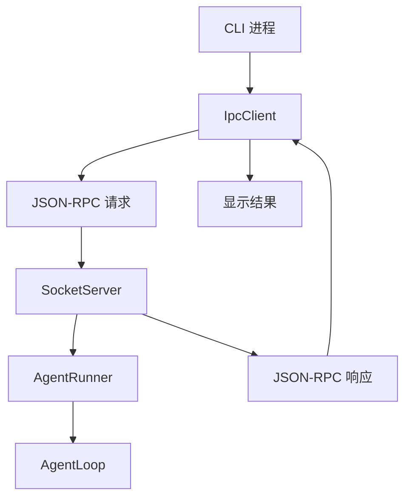

# CLI ↔ Core IPC 化（骨架）— 设计文档

> Spec: `20260716-v074-ipc-skeleton`
> 阶段：设计规划
> 日期：2026-07-16
> 状态：待确认

## 1. 架构设计

### 1.1 整体架构



### 1.2 架构说明

- **CLI 进程**：用户交互，发送请求
- **IpcClient**：JSON-RPC 客户端
- **SocketServer**：JSON-RPC 服务端，处理请求
- **AgentRunner**：执行 Agent 任务

---

## 2. 模块设计

### 2.1 模块清单

| 模块 | 职责 | 依赖 |
|------|------|------|
| SocketServer | JSON-RPC 服务端 | AgentRunner |
| IpcClient | JSON-RPC 客户端 | 无 |
| CLI core 命令 | Core 进程管理 | SocketServer |

### 2.2 模块详细设计

#### SocketServer

**职责**：JSON-RPC 服务端，处理请求

**接口**：

```python
class SocketServer:
    async def start(self) -> None
    async def stop(self) -> None
    async def _handle_line(self, line: bytes, writer: StreamWriter) -> None
```

#### IpcClient

**职责**：JSON-RPC 客户端

**接口**：

```python
class IpcClient:
    async def connect(self) -> None
    async def call(self, method: str, **params) -> dict
    async def wait_for_result(self, run_id: str, timeout: float = 300) -> dict
```

---

## 3. 数据模型

### 3.1 JSON-RPC 请求

```python
{
    "jsonrpc": "2.0",
    "method": "core.run",
    "params": {"session_id": "xxx", "user_input": "xxx"},
    "id": "xxx"
}
```

### 3.2 JSON-RPC 响应

```python
{
    "jsonrpc": "2.0",
    "result": {"run_id": "xxx"},
    "id": "xxx"
}
```

---

## 4. 接口设计

### 4.1 CLI 命令

```bash
rcode core start    # 启动 Core 进程
rcode core stop     # 停止 Core 进程
rcode core status   # 检查 Core 状态
rcode run "xxx"     # 通过 IPC 执行任务
rcode run --local "xxx"  # 同进程模式
```

---

## 5. 错误处理

### 5.1 错误场景

| 场景 | 处理方式 |
|------|----------|
| Core 未启动 | CLI 报错提示 |
| Core 崩溃 | CLI 不 hang，报错 |
| 超时 | CLI 报错提示 |

---

## 6. 技术选型

无新增技术选型，沿用现有模块。
