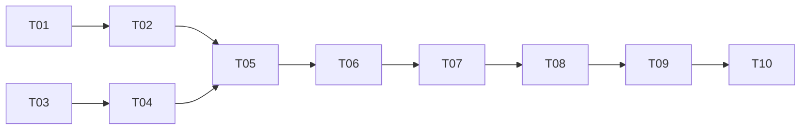

# CLI ↔ Core IPC 化（骨架）— 实现计划

> Spec: `20260716-v074-ipc-skeleton`
> 阶段：设计规划
> 日期：2026-07-16
> 状态：已完成

## 任务清单

### 阶段一：SocketServer 改造

| 序号 | 任务 | 优先级 | 预估时间 | 状态 |
|------|------|--------|----------|------|
| T01 | SocketServer 支持 core.run 异步执行 | P0 | 30min | [x] |
| T02 | SocketServer 支持 core.cancel | P0 | 15min | [x] |

### 阶段二：IPC 客户端

| 序号 | 任务 | 优先级 | 预估时间 | 状态 |
|------|------|--------|----------|------|
| T03 | 新增 IpcClient 类 | P0 | 30min | [x] |
| T04 | IpcClient 支持 call 和 wait_for_result | P0 | 20min | [x] |

### 阶段三：CLI 命令

| 序号 | 任务 | 优先级 | 预估时间 | 状态 |
|------|------|--------|----------|------|
| T05 | 新增 core 命令组 | P0 | 15min | [x] |
| T06 | core start/stop/status 命令 | P0 | 20min | [x] |
| T07 | run 命令支持 --local 参数 | P0 | 15min | [x] |

### 阶段四：测试

| 序号 | 任务 | 优先级 | 预估时间 | 状态 |
|------|------|--------|----------|------|
| T08 | 单元测试：SocketServer | P0 | 20min | [x] |
| T09 | 单元测试：IpcClient | P0 | 20min | [x] |
| T10 | 集成测试：IPC 执行 | P0 | 30min | [-] |

## 依赖关系

## 状态说明

- `[ ]` 未开始
- `[x]` 已完成
- `[-]` 已跳过
- `[!]` 阻塞
