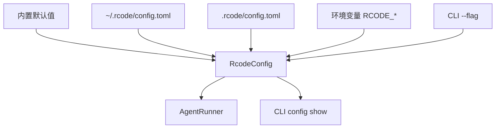

# 配置系统统一 — 设计文档

> Spec: `20260716-v0.7.5-config-unify`
> 阶段：设计规划
> 日期：2026-07-16
> 状态：待确认

## 1. 架构设计

### 1.1 整体架构



### 1.2 架构说明

- **四层优先级**：默认值 → 全局 → 本地 → 环境变量/CLI
- **pydantic 校验**：未知 key 硬拒
- **配置查看**：`rcode config show`

---

## 2. 模块设计

### 2.1 模块清单

| 模块 | 职责 | 依赖 |
|------|------|------|
| RcodeConfig | 配置模型 | pydantic |
| load_config | 配置加载器 | tomllib |
| CLI config | 配置查看命令 | load_config |

### 2.2 模块详细设计

#### RcodeConfig

**职责**：配置模型，支持四层分节

**接口**：

```python
class RcodeConfig(BaseModel):
    model_config = ConfigDict(extra="forbid")
    llm: LLMConfig
    session: SessionConfig
    compact: CompactConfig
    trace: TraceConfig
    log_level: str
    silent: bool
```

#### load_config

**职责**：四层优先级配置加载

**接口**：

```python
def load_config(
    project_dir: str = ".",
    cli_overrides: dict | None = None,
) -> RcodeConfig
```

---

## 3. 数据模型

### 3.1 配置模型

```python
class LLMConfig(BaseModel):
    model_config = ConfigDict(extra="forbid")
    model: str = "mimo-v2.5"
    timeout: int = 120
    max_retries: int = 2

class SessionConfig(BaseModel):
    model_config = ConfigDict(extra="forbid")
    dir: str = ".rcode/sessions"
    auto_archive_days: int = 30

class CompactConfig(BaseModel):
    model_config = ConfigDict(extra="forbid")
    threshold: float = Field(default=0.0, ge=0.0, le=1.0)
    tool_result_limit: int = 8000
    tool_result_keep: int = 4000

class TraceConfig(BaseModel):
    model_config = ConfigDict(extra="forbid")
    dir: str = ".traces"
    max_files: int = 100
```

---

## 4. 接口设计

### 4.1 CLI 命令

```bash
rcode config show    # 显示当前配置
```

---

## 5. 错误处理

### 5.1 错误场景

| 场景 | 处理方式 |
|------|----------|
| 配置文件不存在 | 使用默认值 |
| 配置文件格式错误 | 报错退出 |
| 未知 key | 报错退出 |
| 值越界 | 报错退出 |

---

## 6. 技术选型

- **pydantic**：配置校验
- **tomllib**：TOML 解析（Python 3.11+ 内置）
