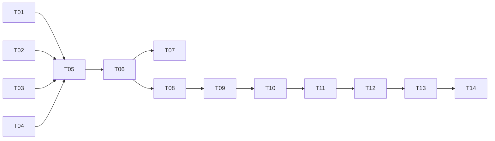

# 配置系统统一 — 实现计划

> Spec: `20260716-v0.7.5-config-unify`
> 阶段：设计规划
> 日期：2026-07-16
> 状态：已完成

## 任务清单

### 阶段一：配置模型

| 序号 | 任务 | 优先级 | 预估时间 | 状态 |
|------|------|--------|----------|------|
| T01 | 新增 LLMConfig 模型 | P0 | 10min | [x] |
| T02 | 新增 SessionConfig 模型 | P0 | 10min | [x] |
| T03 | 新增 CompactConfig 模型 | P0 | 10min | [x] |
| T04 | 新增 TraceConfig 模型 | P0 | 10min | [x] |
| T05 | 新增 RcodeConfig 模型 | P0 | 10min | [x] |

### 阶段二：配置加载器

| 序号 | 任务 | 优先级 | 预估时间 | 状态 |
|------|------|--------|----------|------|
| T06 | 新增 load_config 函数 | P0 | 20min | [x] |
| T07 | 新增 _load_toml 函数 | P0 | 10min | [x] |
| T08 | 新增 _load_env_vars 函数 | P0 | 15min | [x] |

### 阶段三：CLI 命令

| 序号 | 任务 | 优先级 | 预估时间 | 状态 |
|------|------|--------|----------|------|
| T09 | 新增 config 命令组 | P0 | 15min | [x] |
| T10 | 新增 config show 命令 | P0 | 15min | [x] |

### 阶段四：Runner 适配

| 序号 | 任务 | 优先级 | 预估时间 | 状态 |
|------|------|--------|----------|------|
| T11 | Runner 使用 RcodeConfig | P0 | 15min | [x] |

### 阶段五：测试

| 序号 | 任务 | 优先级 | 预估时间 | 状态 |
|------|------|--------|----------|------|
| T12 | 单元测试：配置模型 | P0 | 15min | [x] |
| T13 | 单元测试：配置加载器 | P0 | 20min | [x] |
| T14 | 集成测试：配置查看 | P0 | 15min | [-] |

## 依赖关系

## 状态说明

- `[ ]` 未开始
- `[x]` 已完成
- `[-]` 已跳过
- `[!]` 阻塞
